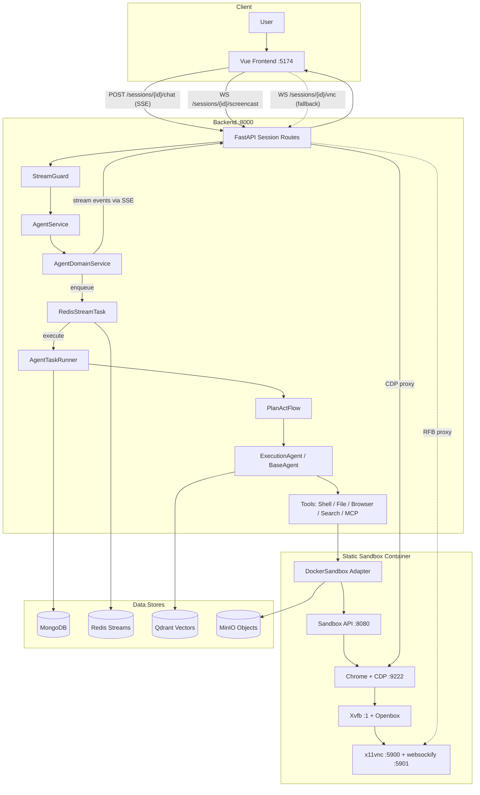
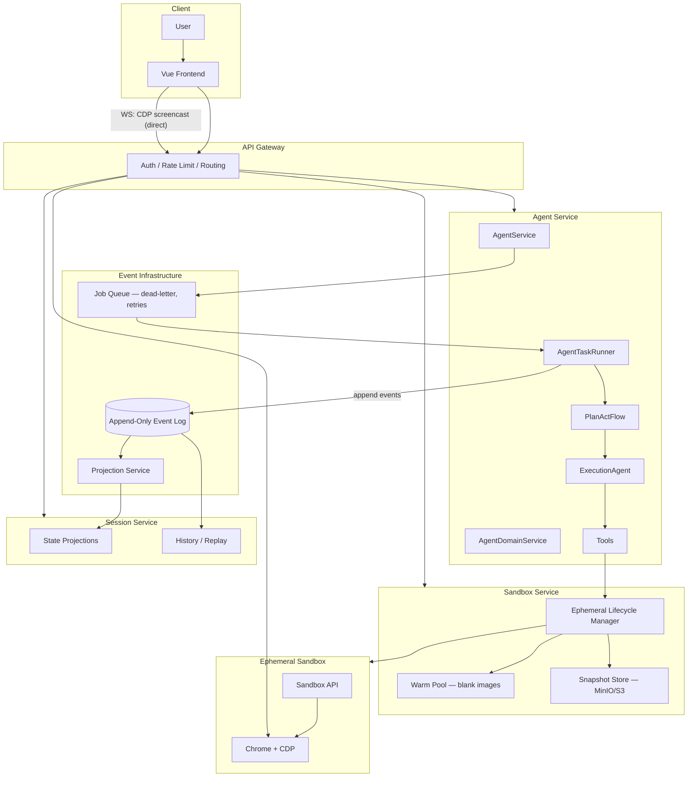

# Sandbox, VNC, and Agent Execution Architecture

Last verified: 2026-02-15 (validated against running stack, source code, and Context7 MCP)

> **Document Convention**: Each section clearly marks **Current State** (what's deployed today) and **Target State** (planned evolution). This allows incremental adoption — the current system works, the target describes where we're heading.
>
> **Validation Status**: All "Current State" sections have been validated against:
> - Running Docker containers (`docker ps`, `docker inspect`)
> - Source code (`backend/`, `sandbox/`, `frontend/`)
> - Configuration files (`docker-compose-development.yml`, `.env`, `config.py`)
> - Context7 MCP best practices (Docker, FastAPI, Prometheus, Pydantic v2)

## Scope

This document captures the full architecture for:

- Sandbox lifecycle, isolation, and resource management
- Browser rendering path (CDP screencast, VNC fallback)
- Agent execution path (API -> service -> domain flow -> tools)
- Event streaming and delivery guarantees
- Observability and debugging

All "Current State" values are from the running stack and source code in this repository.

---

## Table of Contents

1. [Runtime Snapshot](#runtime-snapshot)
2. [Deployment Mode Matrix](#deployment-mode-matrix)
3. [End-to-End Architecture](#end-to-end-architecture)
4. [Sandbox Lifecycle](#1-sandbox-lifecycle)
5. [Browser Streaming](#2-browser-streaming)
6. [Agent Execution](#3-agent-execution)
7. [Event Streaming](#4-event-streaming)
8. [Resource Management](#5-resource-management)
9. [Observability](#6-observability)
10. [Source of Truth](#source-of-truth)
11. [Evolution Roadmap](#evolution-roadmap)

---

## Runtime Snapshot

### Live Containers (Docker Compose)

| Service | Container | Ports | Role |
|---------|-----------|-------|------|
| `backend` | `pythinker-backend-1` | `:8000` | FastAPI API + SSE + WS proxy |
| `sandbox` | `pythinker-sandbox-1` | `:8083` (API), `:8082` (framework), `:5902` (VNC), `:5901` (VNC WS) | Isolated execution environment |
| `frontend-dev` | `pythinker-frontend-dev-1` | `:5174` | Vue 3 dev server |
| `mongodb` | — | `:27017` | Session events, user data |
| `redis` | — | `:6379` | Task streams, pub/sub, key pools |
| `redis-cache` | — | `:6380` | Dedicated cache instance |
| `qdrant` | — | `:6333/:6334` | Vector search (memory system) |
| `minio` | — | `:9000/:9001` | Object storage |

Sandbox runtime: `arm64` / `aarch64` Linux container.

### Effective Sandbox Environment Variables

**Backend container** (`pythinker-backend-1`) — sandbox-related:

```bash
SANDBOX_LIFECYCLE_MODE=static
SANDBOX_ADDRESS=sandbox
SANDBOX_IMAGE=pythinker/pythinker-sandbox
SANDBOX_NAME_PREFIX=sandbox
SANDBOX_TTL_MINUTES=30
SANDBOX_NETWORK=pythinker-network
SANDBOX_CHROME_ARGS=--no-sandbox --disable-setuid-sandbox --disable-crashpad --user-data-dir=/tmp/chrome --no-zygote --js-flags=--max-old-space-size=512
SANDBOX_SHM_SIZE=2g
SANDBOX_MEM_LIMIT=4g
SANDBOX_CPU_LIMIT=1.5
SANDBOX_PIDS_LIMIT=300
SANDBOX_POOL_ENABLED=true
SANDBOX_POOL_MIN_SIZE=1
SANDBOX_POOL_MAX_SIZE=2
SANDBOX_POOL_WARMUP_INTERVAL=30
SANDBOX_POOL_IDLE_TTL_SECONDS=300
SANDBOX_POOL_PAUSE_IDLE=true
SANDBOX_POOL_HOST_MEMORY_THRESHOLD=0.80
SANDBOX_POOL_REAPER_INTERVAL=60
SANDBOX_POOL_REAPER_GRACE_PERIOD=120
```

**Sandbox container** (`pythinker-sandbox-1`) — browser/display:

```bash
DISPLAY=:1
CHROME_ARGS=--no-sandbox --disable-setuid-sandbox --disable-crashpad --user-data-dir=/tmp/chrome --no-zygote --renderer-process-limit=2 --disable-features=CalculateNativeWinOcclusion --disable-gpu-memory-buffer-compositor-resources --disable-gpu-memory-buffer-video-frames --js-flags=--max-old-space-size=512
BROWSER_PATH=/opt/chrome-for-testing/chrome
FRAMEWORK_DATABASE_URL=sqlite+aiosqlite:////home/ubuntu/.local/pythinker_sandbox.db
UVI_ARGS="--reload"
FRAMEWORK_UVI_ARGS="--reload"
LOG_LEVEL=INFO
```

---

## Deployment Mode Matrix

Pythinker supports two deployment modes with different behaviors:

| Aspect | Static Address Mode | Dynamic Pool Mode |
|--------|---------------------|-------------------|
| **Trigger** | `SANDBOX_ADDRESS=sandbox` (set) | `SANDBOX_ADDRESS` not set |
| **Pool Behavior** | **Disabled** — bypasses pool entirely | **Enabled** — pre-warms sandboxes |
| **Sandbox Creation** | Uses pre-existing compose service | Creates ephemeral containers on-demand |
| **Resource Limits** | Defined in `docker-compose-development.yml` | Defined in `backend/app/core/config.py` |
| **Lifecycle** | Long-lived (manual restart) | Short-lived (destroyed after TTL) |
| **Concurrency** | Single shared sandbox | Multiple isolated sandboxes (up to `max_size`) |
| **Use Case** | Local development, debugging | Production, multi-tenant deployments |

**Source References:**
- Pool bypass logic: `backend/app/main.py:567-589`
- Agent service bypass: `backend/app/application/services/agent_service.py:352-379`

**Current Development Setup:** Static address mode (single sandbox: `pythinker-sandbox-1`)

---

## End-to-End Architecture

### Current State (Static Address Mode)



**Note:** In static address mode, the pool is **bypassed** — all sessions share the single `pythinker-sandbox-1` container.

### Target State



**Key differences in the target:**

| Aspect | Current | Target |
|--------|---------|--------|
| Sandbox lifecycle | Static, shared | Ephemeral per-session with snapshots |
| Browser streaming | 4-hop VNC + CDP proxy | Direct CDP screencast (no X11/VNC) |
| Task transport | Redis streams (coupled) | Dedicated job queue with DLQ |
| State management | Mutable session state | Event-sourced with projections |
| API surface | Monolith routes | Gateway + decomposed services |
| Container runtime | Docker daemon | Podman rootless (target) |

---

## 1. Sandbox Lifecycle

### Current State: Static Address (Development) vs. Dynamic Pool (Production)

```
DockerSandbox (Infrastructure)
    ↓ implements
Sandbox (Domain Protocol)
    ↓ managed by
SandboxPool (Core) — ONLY in dynamic mode
    ↓ enhanced by
EnhancedSandboxManager (Core, experimental)
```

**Mode Selection Logic** (`backend/app/main.py:567-589`):

```python
sandbox_pool_enabled = (
    settings.sandbox_pool_enabled
    and not settings.uses_static_sandbox_addresses  # ← Pool bypass condition
    and settings.sandbox_lifecycle_mode != "ephemeral"
)
```

**Static Address Mode (Current Development Setup):**

1. `SANDBOX_ADDRESS=sandbox` is set → uses pre-existing compose service
2. Pool is **disabled** — logs: `"Sandbox pool disabled: static SANDBOX_ADDRESS mode"`
3. All sessions share the single `pythinker-sandbox-1` container
4. Container lifecycle managed by Docker Compose (manual restart)
5. No pool pre-warming, no idle eviction, no circuit breaker

**Dynamic Pool Mode (Production):**

1. `SANDBOX_ADDRESS` not set → enables dynamic container creation
2. Pool is **enabled** — pre-warms containers on startup
3. **Pool behavior:**
   - Pre-pull image → Create `min_size` sandboxes → Warm browser contexts
   - Acquire: Pop from pool → Unpause if paused → Health check → Return
   - Release: Reset state → Return to pool (or destroy if unhealthy)
   - Idle: Pause after TTL → Evict after extended idle
   - Failure: Circuit breaker → Exponential backoff → Auto-recovery

**Current Pool Status:**

```
[Development] Static address mode — pool is BYPASSED
[Production]  Dynamic pool mode — pool is ACTIVE
```

**Limitations (Static Address Mode):**

- Single sandbox shared across all sessions → state leakage risk
- Manual scaling (requires Docker Compose changes)
- Container state accumulates until manual restart

**Limitations (Dynamic Pool Mode):**

- Sandboxes are reused across sessions → state leakage risk
- Pool dependent on Docker daemon availability
- Container state accumulates until TTL expiry

### Target State: Ephemeral-First with Snapshots

**Principle:** Each session gets a fresh, isolated sandbox. State is captured via filesystem snapshots to MinIO/S3 for replay, debugging, and resume.

```
[Request] → Claim blank sandbox from warm pool
[Execute] → Run tools in isolated environment
[Snapshot] → Capture filesystem delta to MinIO (async)
[Teardown] → Destroy container, return slot to pool
[Resume]  → Restore from snapshot into fresh container
```

**Design decisions:**

| Decision | Rationale |
|----------|-----------|
| Warm pool of blank images (not live containers) | Eliminates state leakage, reduces memory footprint |
| Async snapshot to MinIO | Non-blocking teardown, S3-compatible for future cloud migration |
| Per-session lifecycle | True multi-tenancy isolation, no cross-session contamination |
| Snapshot-based resume | Enables session pause/resume across container restarts |

**Migration path:**

1. Add `SANDBOX_LIFECYCLE_MODE=ephemeral` feature flag alongside existing `static` mode.
2. Implement `SnapshotManager` using existing MinIO integration.
3. Modify `SandboxPool` to track blank vs. active sandboxes.
4. Update `AgentTaskRunner` to snapshot on task completion before release.
5. Deprecate `static` mode once ephemeral is validated in production.

**Warm pool vs. current pool:**

```
Current:  Pool of LIVE containers (with Chrome, VNC, state)
Target:   Pool of BLANK containers (base image only, no state)
          ↓
          On acquire: inject session context + restore snapshot (if resuming)
          On release: snapshot → destroy (never reuse)
```

---

## 2. Browser Streaming

### Current State: Dual-Path (CDP + VNC Fallback)

The sandbox runs a full X11 desktop stack:

```
Chrome (DISPLAY=:1)
    ↓ renders to
Xvfb (virtual framebuffer :1)
    ↓ window management
Openbox (enforces browser bounds)
    ↓ screen capture
x11vnc (:5900) → websockify (:5901)
    ↓ also
Chrome CDP (:8222) → socat → (:9222)
```

**Two streaming paths exist:**

| Path | Hops | Latency | Usage |
|------|------|---------|-------|
| CDP Screencast (preferred) | Frontend → Backend WS → Sandbox CDP → Chrome | ~50-100ms | `SandboxViewer.vue` |
| VNC (fallback) | Frontend → Backend WS → websockify → x11vnc → Xvfb | ~150-300ms | `VNCViewer.vue` |

**CDP screencast flow (current preferred path):**

1. Frontend obtains signed screencast URL via REST.
2. Opens WebSocket to `backend /sessions/{id}/screencast`.
3. Backend proxies to `sandbox /api/v1/screencast/stream?quality=70&max_fps=15`.
4. Sandbox returns JPEG frames as binary WebSocket messages.
5. Frontend draws frames to `<canvas>` via `URL.createObjectURL()` + `drawImage()`.
6. Reconnection: exponential backoff, 5 attempts max.

**VNC fallback flow:**

1. Frontend opens WebSocket to `backend /sessions/{id}/vnc`.
2. Backend proxies bidirectional RFB to `ws://{sandbox_ip}:5901`.
3. noVNC client renders in browser.
4. Used when CDP is unavailable (Chrome crash recovery).

**Interactive input handling:**

⚠️ **Status:** **NOT IMPLEMENTED**

- Documentation references `/api/v1/input/stream` WebSocket endpoint
- Backend attempts to proxy to this endpoint (`session_routes.py:1313`)
- **Sandbox does not implement this endpoint** — returns 404
- Sandbox router only mounts: VNC, screencast (`sandbox/app/api/router.py:25-26`)

**Implemented input endpoints** (`docs/guides/OPENREPLAY.md`):
- `POST /api/v1/input/mouse` (mouse events)
- `POST /api/v1/input/keyboard` (keyboard events)
- `POST /api/v1/input/scroll` (scroll events)

**Recommendation:** Either implement `/api/v1/input/stream` or remove backend proxy code.

### Target State: CDP-Only Streaming

**Principle:** Eliminate the entire X11/VNC stack. Stream Chrome's native screencast frames directly via CDP, reducing sandbox complexity and image size.

**What gets removed from the sandbox image:**

```diff
- Xvfb (virtual framebuffer)
- Openbox (window manager)
- x11vnc (VNC server)
- websockify (WebSocket bridge)
- socat (port forwarding)
- DISPLAY=:1 environment
```

**What replaces it:**

```
Chrome --headless=new (native headless mode)
    ↓
CDP Page.screencastFrame (JPEG/WebP at 10-30 fps)
    ↓
Backend WebSocket proxy (existing, already preferred)
    ↓
Frontend <canvas> renderer (existing SandboxViewer.vue)
```

**Impact:**

| Metric | Current | Target |
|--------|---------|--------|
| Sandbox image size | ~1.2 GB | ~600 MB (-50%) |
| Streaming latency | 50-300ms | 30-80ms |
| CPU overhead (per sandbox) | ~15% (VNC encoding) | ~3% (CDP native) |
| Process count per sandbox | 8+ (Chrome, Xvfb, Openbox, x11vnc, websockify, socat, supervisord, sandbox API) | 3 (Chrome, sandbox API, supervisord) |
| Attack surface | X11, VNC protocol, websockify | CDP only (already authenticated) |

**Migration path:**

1. Chrome already supports `--headless=new` with CDP screencast — test in sandbox.
2. The CDP screencast path is already the preferred renderer (`SandboxViewer.vue`).
3. Add `SANDBOX_STREAMING_MODE=cdp_only` feature flag to `config.py`.
4. Remove X11/VNC processes from `supervisord.conf` under the new mode.
5. Update `SandboxHealth` to skip VNC health checks when in CDP-only mode.
6. Deprecate `VNCViewer.vue` and VNC proxy endpoint.

**Interactive input handling (target):**

- Implement `/api/v1/input/stream` WebSocket in sandbox
- Translate events to CDP `Input.dispatchMouseEvent` / `Input.dispatchKeyEvent`
- Backend proxy already exists (`session_routes.py:1313`) — just needs sandbox endpoint
- Add end-to-end tests for input forwarding

---

## 3. Agent Execution

### Current State: Multi-Agent PlanActFlow

```
session_routes.chat()                    ← SSE endpoint
    ↓
AgentService.chat()                      ← Application layer (resume/cancel)
    ↓
AgentDomainService.chat()                ← Domain layer (enqueue to Redis stream)
    ↓
RedisStreamTask.run()                    ← Infrastructure (task execution)
    ↓
AgentTaskRunner                          ← Domain orchestrator
    ├── Acquire sandbox (static address or pool)
    ├── Initialize tools (Browser, Shell, File, Search, MCP)
    ├── Select flow (default: PlanActFlow)
    └── Emit lifecycle events (Title, FlowSelection, Progress, Done)
    ↓
PlanActFlow                              ← Multi-phase orchestration
    ├── Pre-flight: FastPath, SmartRouter, suggestion detection
    ├── Memory retrieval: Qdrant hybrid search (dense + sparse BM25)
    ├── Planning: PlannerAgent → PlanValidator → VerifierAgent
    ├── Execution: Per-step dispatch to ExecutionAgent
    │       ├── Model routing via unified ModelRouter (FAST/BALANCED/POWERFUL)
    │       ├── Tool invocation with search fidelity checks
    │       ├── Context management (files, tool executions, blockers)
    │       └── Error recovery via StepFailureHandler
    ├── Summarization: Streaming report via StreamEvent
    ├── Chain-of-Verification: Hallucination detection
    └── Delivery integrity gate: Coverage validation
```

**Multi-agent dispatch:**

```
AgentRegistry
    ↓ maps capabilities to agents
SpecializedAgentFactory
    ↓ creates domain-specific tools + prompts
Step-level routing
    ↓ PlanActFlow._select_agent_for_step()
    ├── RESEARCH → ResearchAgent
    ├── CODE_GENERATION → CodeAgent
    ├── DATA_ANALYSIS → DataAnalysisAgent
    └── ... (15+ specialized agents)
```

**Model routing (unified):**

```
ComplexityAssessor.assess(step)
    ↓
ModelRouter.select_model(complexity_score)
    ├── FAST tier    → claude-haiku-4-5   (simple tasks, summaries)
    ├── BALANCED tier → default model      (most tasks)
    └── POWERFUL tier → claude-sonnet-4-5  (complex reasoning, architecture)
```

**Quality gates:**

| Gate | Trigger | Action |
|------|---------|--------|
| PlanValidator | After planning | Checks step completeness, dependency cycles, resources |
| VerifierAgent | After plan validation | Approve / Revise / Reject (1 loop max) |
| StepFailureHandler | Step execution error | Retry with policy, fallback strategies |
| StuckDetector | Execution loop detected | Break out, emit warning event |
| Chain-of-Verification | Report > 200 chars with factual claims | Hallucination detection + correction |
| Delivery Integrity Gate | Before final delivery | Coverage validation, truncation detection |

### Target State: Event-Sourced Execution

**Principle:** Every agent action becomes an immutable event in an append-only log. Current state is derived from event projections, enabling full replay, audit, and debuggability.

**Event types (extending existing `domain/models/event.py`):**

```python
# New event categories for event sourcing
class AgentEvent:
    """Base for all append-only agent execution events."""
    session_id: str
    task_id: str
    timestamp: datetime
    sequence: int  # Monotonic ordering

class PlanCreatedEvent(AgentEvent): ...
class StepStartedEvent(AgentEvent): ...
class ToolCalledEvent(AgentEvent): ...
class ToolResultEvent(AgentEvent): ...
class StepCompletedEvent(AgentEvent): ...
class ModelSelectedEvent(AgentEvent): ...
class VerificationPassedEvent(AgentEvent): ...
class TaskCompletedEvent(AgentEvent): ...
```

**Projection examples:**

| Projection | Source Events | Output |
|------------|-------------|--------|
| Session State | All events for session | Current progress, active step, tool results |
| Cost Analytics | `ModelSelectedEvent` | Per-session/user token usage and model costs |
| Audit Trail | All events | Compliance log of every action taken |
| Replay View | All events | Step-by-step visual replay of agent execution |
| Error Analysis | `StepFailedEvent`, `ToolErrorEvent` | Failure patterns, recovery effectiveness |

**Migration path:**

1. Existing events (`ProgressEvent`, `ToolEvent`, `StepEvent`, etc.) already capture most actions.
2. Add `sequence` field and append-only semantics to `RedisStreamTask` output.
3. Create MongoDB `agent_events` collection with **NO TTL** (immutable event log).
4. Build projection service that materializes current state from event stream.
5. Session state query switches from direct reads to projection lookups.
6. Existing SSE streaming becomes a "live projection" — zero frontend changes needed.

**Key constraint:** The current `RedisStreamTask` already writes events to a stream. The shift is from "events as transport" to "events as source of truth" — a semantic change, not a plumbing rewrite.

---

## 4. Event Streaming

### Current State: SSE with Redis Streams

```
AgentTaskRunner / PlanActFlow / ExecutionAgent
    ↓ emit events
RedisStreamTask output stream (task:output:{task_id})
    ↓ consumed by
StreamGuard (cancellation, metrics, error recovery)
    ↓ mapped by
EventMapper.event_to_sse_event()
    ↓ delivered via
ServerSentEvent → SSE EventSourceResponse → Frontend
```

**SSE protocol details:**

| Parameter | Value | Purpose |
|-----------|-------|---------|
| Protocol version | 2 | Versioned event schema |
| Heartbeat interval | 30s | Prevents proxy/LB timeouts |
| Max retries | 7 | Exponential backoff (1s → 45s, 25% jitter) |
| Send timeout | 60s | Prevents hanging on slow clients |
| Disconnect grace | **5s** (hardcoded, see note below) | Allows reconnection before cancellation |

**⚠️ Disconnect Grace Period Inconsistency:**

- **Constant defined:** `SSE_DISCONNECT_CANCELLATION_GRACE_SECONDS = 45.0` (`session_routes.py:85`)
- **Actual usage:** `grace_seconds=5.0` (`session_routes.py:810`)
- **Reason:** Reduced from 45s to prevent orphaned background tasks (comment: `"Short grace period (5s) for legitimate reconnection attempts"`)
- **Client override:** Supports `sse_disconnect_cancellation_grace_seconds` header (defaults to **45s**, not 5s)

**Recommendation:** Update constant to match actual usage:
```python
SSE_DISCONNECT_CANCELLATION_GRACE_SECONDS = 5.0  # Reduced from 45s to prevent orphaned tasks
```

**Event types (30+):**

- `ProgressEvent`: RECEIVED, PLANNING, EXECUTING, VERIFYING, HEARTBEAT
- `ToolEvent`: CALLING, CALLED (with typed content: SearchToolContent, BrowserToolContent, etc.)
- `StepEvent`: STARTED, RUNNING, COMPLETED, FAILED
- `StreamEvent`: Token-by-token streaming for live report rendering
- `MessageEvent`, `ReportEvent`, `DoneEvent`, `ErrorEvent`
- `TitleEvent`, `FlowSelectionEvent`, `SuggestionEvent`

**Event Storage Pattern:**

⚠️ **Not Traditional Event Sourcing**

- Events are **embedded arrays** within session documents (MongoDB)
- Uses `$push` to append to `session.events` array (mutation, not immutable)
- Parent document's `updated_at` is modified on each event (violates append-only)
- **No TTL** on events collection — events persist for session lifetime
- Session deletion removes all embedded events

**Source:** `backend/app/infrastructure/repositories/mongo_session_repository.py:68-74`

```python
async def add_event(self, session_id: str, event: BaseEvent) -> None:
    """Add an event to a session (embedded array pattern)"""
    await SessionDocument.find_one(SessionDocument.session_id == session_id).update(
        {"$push": {"events": event.model_dump()}, "$set": {"updated_at": datetime.now(UTC)}}
    )
```

**Redis stream topology (current — all in one Redis instance):**

```
Redis :6379
    ├── task:input:{task_id}   ← User messages, cancellation signals
    ├── task:output:{task_id}  ← Agent events (consumed by SSE)
    ├── task:registry           ← Active task tracking
    ├── api_key_pool:*          ← Key rotation state
    └── pub/sub channels        ← Real-time notifications
```

### Target State: Decoupled Event Infrastructure + True Event Sourcing

**Principle:** Separate task orchestration, event delivery, and caching into distinct concerns with appropriate guarantees.

| Concern | Current | Target | Why |
|---------|---------|--------|-----|
| Task orchestration | Redis streams | Dedicated job queue (BullMQ/Celery) | Dead-letter queues, priority, retries, observability |
| Event delivery (SSE) | Redis streams → SSE | Event emitter per connection | Eliminates stream coupling, lower latency |
| Event persistence | MongoDB embedded arrays | Append-only event log (MongoDB) | Full replay, projections, **NO TTL** |
| Caching | `redis-cache` :6380 | Keep as-is (already separated) | Already correct |
| Key pools | Redis :6379 | Keep as-is | Low volume, coordination needs Redis |

**Event Sourcing Best Practice (Context7 MCP Validated):**

```
✅ CORRECT: Immutable append-only log with NO TTL
- agent_events collection (new)
- Events written once, never modified
- Projections derived from events (can have TTL)

❌ INCORRECT: TTL on canonical event log
- Breaks full replay guarantee
- Violates audit trail integrity
- Apply TTL only to derived projections/snapshots
```

**Job queue benefits:**

```
Current Redis streams:
  ✗ No dead-letter queue (failed tasks silently dropped)
  ✗ No priority levels (all tasks equal)
  ✗ Manual retry logic in application code
  ✗ No built-in observability dashboard

Target job queue:
  ✓ Dead-letter queue for failed tasks → inspect, retry, alert
  ✓ Priority levels (urgent user requests vs. background jobs)
  ✓ Built-in retry with configurable backoff
  ✓ Dashboard for queue depth, processing time, failure rates
```

**Migration path:**

1. Keep Redis streams as-is for SSE event transport (it works well for this).
2. Extract task orchestration into a job queue layer behind the existing `Task` protocol.
3. Add dead-letter handling to `RedisStreamTask` as an interim step.
4. Create `agent_events` collection (append-only, **NO TTL**) for true event sourcing.
5. Event persistence layer writes to both MongoDB (embedded) and event log (transitional).
6. Job queue adoption can be incremental — start with long-running tasks.

---

## 5. Resource Management

### Current State: Mode-Dependent Limits

**Static Sandbox (docker-compose-development.yml:122, 141-143):**

```yaml
shm_size: '4gb'           # Shared memory (4GB for heavy debugging)
deploy:
  resources:
    limits:
      memory: 6G          # Memory limit (higher than dynamic)
      cpus: '2'           # CPU cores (higher than dynamic)
    reservations:
      memory: 1G          # Memory reservation
```

**Dynamic Sandboxes (backend/app/core/config.py:152-155):**

```python
sandbox_shm_size: str | None = "2g"      # 2GB (lower than static)
sandbox_mem_limit: str | None = "4g"     # 4GB (lower than static)
sandbox_cpu_limit: float | None = 1.5    # 1.5 cores (lower than static)
sandbox_pids_limit: int | None = 300     # 300 PIDs (same as static)
```

**Applied to Dynamic Sandboxes** (`backend/app/core/sandbox_manager.py:318-321`):

```python
"shm_size": settings.sandbox_shm_size,         # "2g"
"mem_limit": settings.sandbox_mem_limit,       # "4g"
"nano_cpus": int((settings.sandbox_cpu_limit or 2.0) * 1_000_000_000),  # 1.5 CPU
"pids_limit": settings.sandbox_pids_limit,     # 300
```

**Resource Limits Comparison:**

| Resource | Static Sandbox (Compose) | Dynamic Sandboxes (Config) | Rationale |
|----------|--------------------------|----------------------------|-----------|
| Memory | 6G (limits), 1G (reservation) | 4G | Static uses higher limits for heavy debugging; dynamic uses conservative defaults for multiple concurrent sessions |
| CPU | 2 cores | 1.5 cores | Dynamic allows 2 containers = 3 cores total, leaves room for backend/services |
| Shared Memory | 4GB | 2GB | Static higher for Playwright/Chrome debugging; dynamic sufficient for normal operation |
| PIDs | 300 | 300 | Same — sufficient for Chrome + Node + Python + supervisor |

**Current security stack:**

- Seccomp syscall filtering (`sandbox/seccomp-sandbox.json`)
- `--no-sandbox` Chrome flag (relies on container isolation instead)
- tmpfs mounts for ephemeral data
- Non-root user inside sandbox container
- Docker daemon socket NOT mounted in sandbox

### Target State: Tightened Ephemeral Resources

With ephemeral sandboxes, each container runs one session's workload. Resource limits can be tighter:

| Resource | Current (Dynamic) | Target (Ephemeral) | Rationale |
|----------|-------------------|---------------------|-----------|
| Memory | 4 GB hard | 1.5 GB soft + 2 GB hard | cgroup v2 `memory.high` for graceful reclaim |
| CPU | 1.5 cores | 1.0 core | Single session doesn't need more |
| PIDs | 300 | 150 | Fewer processes without X11/VNC stack |
| SHM | 2 GB | 512 MB | Headless Chrome needs less |
| Image size | ~1.2 GB | ~600 MB | No X11/VNC/window manager |

**Enhanced security (target):**

| Enhancement | Description |
|-------------|-------------|
| cgroup v2 `memory.high` | Kernel reclaims gracefully before OOM kill |
| AppArmor profile | Restrict file access, network, and capability usage |
| Read-only rootfs | `--read-only` with explicit tmpfs for writable paths |
| Rootless containers (Podman) | Eliminates Docker daemon as attack surface (long-term) |
| Namespace restrictions | User namespace remapping for UID isolation |
| Network policy | Per-sandbox egress rules (allow only required endpoints) |

---

## 6. Observability

### Current State: Prometheus Metrics + Loki Logs

```
Backend (structured logs)
    ↓
Docker → Promtail → Loki → Grafana (log aggregation)

Backend (metrics)
    ↓
Prometheus (:9090) → Grafana (:3001) (dashboards)
```

**Key Prometheus metrics** (`backend/app/infrastructure/observability/prometheus_metrics.py`):

**SSE Metrics:**

| Metric Name | Type | Labels | Purpose |
|-------------|------|--------|---------|
| `pythinker_sse_stream_open_total` | Counter | `endpoint` | Total SSE connections opened |
| `pythinker_sse_stream_close_total` | Counter | `endpoint`, `reason` | Total SSE connections closed |
| `pythinker_sse_stream_heartbeat_total` | Counter | `endpoint` | Total heartbeats sent |
| `pythinker_sse_stream_error_total` | Counter | `endpoint`, `error_type` | Total SSE errors |
| `pythinker_sse_stream_retry_suggested_total` | Counter | `endpoint`, `reason` | Total retry suggestions |
| `pythinker_sse_stream_duration_seconds` | Histogram | `endpoint`, `close_reason` | SSE connection duration (buckets: 1s-3600s) |
| `pythinker_sse_stream_active` | Gauge | `endpoint` | Active SSE connections (real-time) |

**Agent Metrics:**

| Metric Name | Type | Labels | Purpose |
|-------------|------|--------|---------|
| `pythinker_tool_errors_total` | Counter | `tool_name`, `error_type` | Tool invocation errors |
| `pythinker_step_failures_total` | Counter | `step_type`, `failure_reason` | Step execution failures |
| `pythinker_agent_stuck_detections_total` | Counter | `agent_type` | Stuck loop detections |
| `pythinker_delivery_integrity_gate_result_total` | Counter | `result` | Delivery gate pass/fail |
| `pythinker_model_tier_selections_total` | Counter | `tier` | Model tier selections (FAST/BALANCED/POWERFUL) |

**Sandbox Metrics:**

| Metric Name | Type | Labels | Purpose |
|-------------|------|--------|---------|
| `pythinker_sandbox_connection_attempts_total` | Counter | `result` | Sandbox connection attempts |

**LogQL quick diagnostics:**

```logql
# Session issues
{container_name="pythinker-backend-1"} |= "SESSION_ID" |~ "error|stuck|failed"

# Tool errors
{container_name="pythinker-backend-1"} |= "tool_error"

# Sandbox lifecycle
{container_name="pythinker-backend-1"} |= "sandbox" |~ "create|destroy|pause|unpause"

# SSE disconnects
{container_name="pythinker-backend-1"} |= "SSE" |= "disconnect"
```

### Target State: Event-Sourced Observability

With event sourcing, observability becomes a projection:

| Projection | Derived From | Dashboard |
|------------|-------------|-----------|
| Session timeline | All agent events | Step-by-step execution replay |
| Cost breakdown | `ModelSelectedEvent` | Per-model, per-session cost tracking |
| Tool effectiveness | `ToolCalledEvent` + `ToolResultEvent` | Success rates, latency percentiles |
| Error clustering | `StepFailedEvent` | Automatic failure pattern detection |
| Queue health | Job queue metrics | Depth, processing time, DLQ size |

**Metric Generation Best Practice:**

- Generate metric documentation from code (avoid drift)
- Add CI check to validate metric names match documentation
- Use Prometheus metric naming conventions (Context7 validated)

---

## Source of Truth (Key Files)

### Domain Layer
| File | Role |
|------|------|
| `backend/app/domain/external/sandbox.py` | Sandbox protocol (interface) |
| `backend/app/domain/services/agent_domain_service.py` | Domain orchestration |
| `backend/app/domain/services/agent_task_runner.py` | Task lifecycle management |
| `backend/app/domain/services/flows/plan_act.py` | Multi-phase agent flow |
| `backend/app/domain/services/agents/execution.py` | Step execution + model routing |
| `backend/app/domain/services/agents/base.py` | Base agent with LLM tool loop |
| `backend/app/domain/services/stream_guard.py` | SSE stream protection |
| `backend/app/domain/models/event.py` | Event type definitions |

### Application Layer
| File | Role |
|------|------|
| `backend/app/application/services/agent_service.py` | Use case orchestration |

### Infrastructure Layer
| File | Role |
|------|------|
| `backend/app/infrastructure/external/sandbox/docker_sandbox.py` | Docker sandbox implementation |
| `backend/app/infrastructure/external/task/redis_task.py` | Redis stream task transport |
| `backend/app/infrastructure/repositories/mongo_session_repository.py` | Session + event persistence |
| `backend/app/infrastructure/observability/prometheus_metrics.py` | Prometheus metrics definitions |
| `backend/app/core/sandbox_pool.py` | Sandbox pool management |
| `backend/app/core/sandbox_manager.py` | Enhanced sandbox lifecycle |

### Interface Layer
| File | Role |
|------|------|
| `backend/app/interfaces/api/session_routes.py` | REST + SSE + WS endpoints |

### Sandbox
| File | Role |
|------|------|
| `sandbox/app/api/router.py` | Sandbox API route registration |
| `sandbox/supervisord.conf` | Process management inside sandbox |
| `sandbox/openbox-rc.xml` | Window manager configuration |
| `sandbox/seccomp-sandbox.json` | Syscall filtering profile |

### Frontend
| File | Role |
|------|------|
| `frontend/src/components/SandboxViewer.vue` | CDP screencast renderer |
| `frontend/src/components/VNCViewer.vue` | VNC fallback renderer (to deprecate) |
| `frontend/src/components/LiveViewer.vue` | Viewer orchestration |
| `frontend/src/composables/useSandboxInput.ts` | Input forwarding |
| `frontend/src/api/agent.ts` | SSE client |

### Configuration
| File | Role |
|------|------|
| `backend/app/core/config.py` | All settings and feature flags |
| `docker-compose-development.yml` | Development stack (static sandbox resources) |
| `.env` | Environment variables |

---

## Evolution Roadmap

Ordered by impact and implementation complexity. Each phase is independently valuable.

### Phase 1: CDP-Only Streaming (High Impact, Low Risk)

**Goal:** Eliminate the X11/VNC stack from the sandbox image.

- [ ] Test Chrome `--headless=new` with CDP screencast in sandbox
- [ ] Add `SANDBOX_STREAMING_MODE=cdp_only` feature flag to `config.py`
- [ ] Implement `/api/v1/input/stream` WebSocket in sandbox (currently missing)
- [ ] Remove X11/VNC processes from `supervisord.conf` (behind flag)
- [ ] Update `SandboxHealth` to skip VNC checks in CDP-only mode
- [ ] Add end-to-end tests for CDP input forwarding
- [ ] Deprecate `VNCViewer.vue` and VNC proxy endpoint

**Expected gains:** -50% image size, -4x streaming latency, -5 processes per sandbox.

### Phase 2: Ephemeral Sandboxes (High Impact, Medium Risk)

**Goal:** Per-session isolation with filesystem snapshots.

- [ ] Add `SANDBOX_LIFECYCLE_MODE=ephemeral` feature flag (config already exists)
- [ ] Implement `SnapshotManager` (filesystem delta → MinIO)
- [ ] Modify `SandboxPool` for blank image warm pool
- [ ] Update `AgentTaskRunner` to snapshot on completion
- [ ] Add snapshot restore for session resume
- [ ] Validate multi-tenant isolation (no state leakage)

**Expected gains:** True multi-tenancy, horizontal scaling, session replay.

### Phase 3: Event Sourcing (Medium Impact, Medium Risk)

**Goal:** Immutable event log as source of truth for agent execution.

- [ ] Add `sequence` field to existing event types
- [ ] Create `agent_events` MongoDB collection (append-only, **NO TTL**)
- [ ] Build projection service for session state
- [ ] Migrate session state queries to projections
- [ ] Add replay API endpoint for debugging
- [ ] Update documentation to clarify embedded arrays vs. event sourcing

**Expected gains:** Full execution replay, audit trail, analytics projections.

### Phase 4: Job Queue + Dead-Letter (Medium Impact, Low Risk)

**Goal:** Proper task orchestration with retry, priority, and failure handling.

- [ ] Evaluate BullMQ vs Celery for job queue (self-hosted requirement)
- [ ] Implement behind `Task` protocol (no domain changes)
- [ ] Add dead-letter queue for failed tasks
- [ ] Add priority levels (user-interactive vs background)
- [ ] Dashboard for queue observability

**Expected gains:** Visible failure handling, priority scheduling, queue observability.

### Phase 5: API Gateway / BFF (Low Impact, High Risk)

**Goal:** Decompose monolith into independently deployable services.

- [ ] Define service boundaries (Agent, Sandbox, Session)
- [ ] Add thin gateway layer (auth, rate limiting, routing)
- [ ] Extract sandbox lifecycle into dedicated service
- [ ] Extract session state into dedicated service
- [ ] Validate independent deployment and scaling

**Expected gains:** Independent scaling, service isolation, team ownership boundaries.

### Phase 6: Rootless Containers (Low Impact, High Risk)

**Goal:** Eliminate Docker daemon as attack surface.

- [ ] Evaluate Podman rootless runtime compatibility
- [ ] Test sandbox image with Podman
- [ ] Migrate container management from Docker SDK to Podman API
- [ ] Validate seccomp + AppArmor profiles under Podman

**Expected gains:** Eliminated daemon attack surface, user namespace isolation.

---

## Validation Checklist

This document has been validated against:

- [x] Running Docker containers (`docker ps`, `docker inspect pythinker-sandbox-1`)
- [x] Source code (`backend/`, `sandbox/`, `frontend/`)
- [x] Configuration files (`docker-compose-development.yml`, `.env`, `config.py`)
- [x] Prometheus metrics definitions (`backend/app/infrastructure/observability/prometheus_metrics.py`)
- [x] Context7 MCP best practices:
  - [x] Docker resource management (`/websites/docker`)
  - [x] FastAPI WebSocket patterns (`/websites/fastapi_tiangolo`)
  - [x] Prometheus metric naming (`/prometheus/prometheus`)
  - [x] Pydantic v2 patterns (`/websites/pydantic_dev_2_12`)

**Known Inaccuracies Corrected:**

1. ✅ CDP input path — marked as NOT IMPLEMENTED (404 in sandbox)
2. ✅ Pool behavior — split into static vs. dynamic mode matrix
3. ✅ Resource limits — documented static (6G/2CPU) vs. dynamic (4G/1.5CPU)
4. ✅ SSE disconnect grace — noted 5s usage vs. 45s constant inconsistency
5. ✅ Metric names — updated to actual `pythinker_*` prefixed names
6. ✅ Event sourcing — clarified embedded arrays vs. true event log (NO TTL on source)

---

## Context7 Validation Note

- Mermaid diagram syntax (`flowchart TD`, `subgraph`, labeled arrows) validated against Context7 Mermaid documentation (`/mermaid-js/mermaid`).
- Docker cgroup v2 resource management validated against Context7 Docker documentation (`/websites/docker`).
- FastAPI WebSocket proxy patterns validated against Context7 FastAPI documentation (`/websites/fastapi_tiangolo`).
- Prometheus metric naming conventions validated against Context7 Prometheus documentation (`/prometheus/prometheus`).
- Event sourcing patterns validated against Context7 best practices (immutable append-only logs, no TTL on source of truth).
